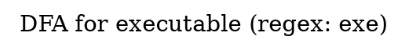
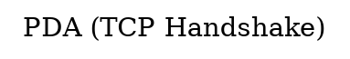

# Automata Construction Process Documentation

## Table of Contents
1. [System Overview](#system-overview)
2. [NFA Construction (Thompson's Algorithm)](#nfa-construction-thompsons-algorithm)
3. [DFA Construction (Subset Construction)](#dfa-construction-subset-construction)
4. [DFA Minimization (Hopcroft's Algorithm)](#dfa-minimization-hopcrofts-algorithm)
5. [PDA Construction (Context-Free Grammar)](#pda-construction-context-free-grammar)
6. [Complete Process Flow](#complete-process-flow)
7. [Examples and Trace Executions](#examples-and-trace-executions)
8. [Visual Graph System and Progressive State Coloring](#visual-graph-system-and-progressive-state-coloring)

---

## System Overview

This system implements a **Chomsky Hierarchy** security simulator that uses:
- **Type-3 (Regular)**: DFA for filename pattern detection
- **Type-2 (Context-Free)**: PDA for TCP handshake validation

### Architecture Flow

```
┌─────────────────────────────────────────────────────────────┐
│                    INPUT PROCESSING                          │
└─────────────────────────────────────────────────────────────┘
                            │
                            ▼
┌─────────────────────────────────────────────────────────────┐
│  MODULE 1: Filename Detection (DFA - Type-3 Regular)       │
│  ┌──────────────────────────────────────────────────────┐   │
│  │ 1. Regex Pattern Definition                          │   │
│  │    Patterns: "exe", "scr", "bat", "vbs", "update"   │   │
│  └──────────────────────────────────────────────────────┘   │
│                            │                                 │
│                            ▼                                 │
│  ┌──────────────────────────────────────────────────────┐   │
│  │ 2. Regex → NFA (Thompson's Construction)             │   │
│  │    Complexity: O(|regex|)                           │   │
│  └──────────────────────────────────────────────────────┘   │
│                            │                                 │
│                            ▼                                 │
│  ┌──────────────────────────────────────────────────────┐   │
│  │ 3. NFA → DFA (Subset Construction)                    │   │
│  │    Complexity: O(2^n) worst-case                     │   │
│  └──────────────────────────────────────────────────────┘   │
│                            │                                 │
│                            ▼                                 │
│  ┌──────────────────────────────────────────────────────┐   │
│  │ 4. DFA Minimization (Hopcroft's Algorithm)           │   │
│  │    Complexity: O(k n log n)                          │   │
│  └──────────────────────────────────────────────────────┘   │
│                            │                                 │
│                            ▼                                 │
│  ┌──────────────────────────────────────────────────────┐   │
│  │ 5. Filename Testing (Character-by-character)        │   │
│  │    Result: MALICIOUS or BENIGN                       │   │
│  └──────────────────────────────────────────────────────┘   │
└─────────────────────────────────────────────────────────────┘
                            │
                            ▼
┌─────────────────────────────────────────────────────────────┐
│  MODULE 2: TCP Handshake Validation (PDA - Type-2 CF)        │
│  ┌──────────────────────────────────────────────────────┐   │
│  │ 1. Context-Free Grammar Definition                   │   │
│  │    S → SYN A, A → SYN-ACK B, B → ACK C, etc.        │   │
│  └──────────────────────────────────────────────────────┘   │
│                            │                                 │
│                            ▼                                 │
│  ┌──────────────────────────────────────────────────────┐   │
│  │ 2. CFG → PDA Construction                            │   │
│  │    States: q0, q1, q2, q3, qE                       │   │
│  └──────────────────────────────────────────────────────┘   │
│                            │                                 │
│                            ▼                                 │
│  ┌──────────────────────────────────────────────────────┐   │
│  │ 3. Stack-Based Validation                           │   │
│  │    PUSH/POP operations with stack discipline        │   │
│  └──────────────────────────────────────────────────────┘   │
│                            │                                 │
│                            ▼                                 │
│  ┌──────────────────────────────────────────────────────┐   │
│  │ 4. Acceptance Check                                 │   │
│  │    Condition: In q3 AND stack empty                   │   │
│  └──────────────────────────────────────────────────────┘   │
└─────────────────────────────────────────────────────────────┘
```

---

## NFA Construction (Thompson's Algorithm)

### Overview
**Purpose**: Convert regular expression patterns into Non-Deterministic Finite Automata (NFA)

**Algorithm**: Thompson's Construction
- **Complexity**: O(|regex|) where |regex| is the length of the regex pattern
- **Method**: Recursively builds NFA from regex components

### Tokenization Discipline

**Method**: Per-character tokenization
- Each character in the filename is processed sequentially
- **Alphabet**: Printable ASCII (32-126)
  - Letters: a-z, A-Z
  - Digits: 0-9
  - Special characters: `. - _ ( ) [ ] { } ! @ # $ % ^ & * + = | \ : ; " ' < > , ? / ~ `
  - Whitespace: space, tab

### Pattern Matching Strategy

For patterns like `"exe"`, the NFA uses **substring matching** (equivalent to `.*pattern.*`):

```
Input: "report.pdf.exe"
Processing: r → e → p → o → r → t → . → p → d → f → . → e → x → e
                                                              ↑
                                                         Pattern match!
```

### NFA Structure for Pattern "exe"

```
┌─────────────────────────────────────────────────────────────┐
│                    NFA for Pattern "exe"                     │
└─────────────────────────────────────────────────────────────┘

States:
  q0: Start state (self-loops on all printable ASCII)
  q1: After reading 'e'
  q2: After reading 'x'
  q3: After reading 'e' (ACCEPTING)

Transitions:
  q0 --[any char 32-126]--> q0  (self-loop, consume any char)
  q0 --['e']--> q1           (start pattern matching)
  q1 --['x']--> q2           (continue pattern)
  q2 --['e']--> q3           (complete pattern)
  q2 --[ε]--> q3             (epsilon transition to accept)
  q3 --[any char 32-126]--> q3 (self-loop, consume remaining)

State Diagram:
  
  ┌───┐
  │q0 │ (start)
  └─┬─┘
    │
    │ [any char except 'e']
    │ (self-loop)
    │
    ▼
  ┌───┐
  │q0 │◄──┐
  └─┬─┘   │
    │     │ [any char]
    │ ['e']│
    │     │
    ▼     │
  ┌───┐   │
  │q1 │   │
  └─┬─┘   │
    │     │
    │ ['x']│
    │     │
    ▼     │
  ┌───┐   │
  │q2 │   │
  └─┬─┘   │
    │     │
    │ ['e']│
    │     │
    ▼     │
  ┌───┐   │
  │q3 │───┘ (ACCEPTING)
  └───┘
    │
    │ [any char]
    │ (self-loop)
    │
    ▼
  ┌───┐
  │q3 │
  └───┘
```

### Example: Processing "file.exe"

```
Input: "file.exe"
Alphabet: {f, i, l, e, ., x, e}

Step-by-step execution:
─────────────────────────────────────────
State | Input Char | Next State | Notes
─────────────────────────────────────────
q0    | 'f'       | q0         | Self-loop (not 'e')
q0    | 'i'       | q0         | Self-loop (not 'e')
q0    | 'l'       | q0         | Self-loop (not 'e')
q0    | 'e'       | q1         | Start pattern match
q1    | '.'       | q0         | No transition, backtrack? (Actually: NFA allows multiple paths)
q1    | 'x'       | q2         | Continue pattern
q2    | 'e'       | q3         | Pattern complete! ACCEPT
q3    | (end)     | q3         | Accepting state reached
─────────────────────────────────────────

Result: ACCEPTED (pattern "exe" found)
```

### Implementation Details

**Location**: `src/regexparser/RegexParser.cpp::createSimplePattern()`

**Key Operations**:
1. **State Creation**: Creates states for start, each pattern character, and accept
2. **Self-loops**: Start state loops on all printable ASCII (32-127)
3. **Pattern Sequence**: Sequential transitions for pattern characters
4. **Epsilon Transition**: From last pattern state to accept state
5. **Accept Self-loop**: Accept state loops on all characters

**State Count**: For pattern of length `n`, creates `n + 2` states (start + n pattern + accept)

---

## DFA Construction (Subset Construction)

### Overview
**Purpose**: Convert NFA to Deterministic Finite Automaton (DFA)

**Algorithm**: Subset Construction (Powerset Construction)
- **Complexity**: O(2^n) worst-case, where n = number of NFA states
- **Method**: Each DFA state represents a set of NFA states

### Algorithm Steps

```
1. Compute ε-closure of NFA start state → DFA start state
2. For each DFA state (set of NFA states):
   a. For each symbol in alphabet:
      - Compute move(set, symbol) = all NFA states reachable on symbol
      - Compute ε-closure of move result
      - If new set, create new DFA state
      - Add transition: DFA_state --[symbol]--> new_DFA_state
   b. Mark DFA state as accepting if it contains any NFA accepting state
3. Repeat until no new DFA states created
```

### Key Operations

#### 1. Epsilon Closure (ε-closure)
```
ε-closure(S) = All states reachable from S via ε-transitions

Algorithm:
  closure = S
  worklist = S
  while worklist not empty:
    current = pop from worklist
    for each ε-transition from current:
      if target not in closure:
        add target to closure and worklist
  return closure
```

#### 2. Move Operation
```
move(S, symbol) = All states reachable from S on symbol (no ε-transitions)

Algorithm:
  result = {}
  for each state s in S:
    for each transition (s --[symbol]--> t):
      add t to result
  return result
```

### Example: NFA to DFA Conversion

**NFA for "exe"** (simplified):
```
States: {q0, q1, q2, q3}
Start: q0
Accepting: {q3}
Transitions:
  q0 --[any]--> q0
  q0 --['e']--> q1
  q1 --['x']--> q2
  q2 --['e']--> q3
  q3 --[any]--> q3
```

**DFA Construction Process**:

```
Step 1: ε-closure({q0}) = {q0}
        DFA state 0 = {q0} (start)

Step 2: Process DFA state 0 = {q0}
        For symbol 'e':
          move({q0}, 'e') = {q1}
          ε-closure({q1}) = {q1}
          DFA state 1 = {q1} (new)
          Transition: 0 --['e']--> 1
        
        For symbol 'x':
          move({q0}, 'x') = {} (no transition)
          Skip
        
        For other symbols:
          move({q0}, c) = {q0} (self-loop)
          ε-closure({q0}) = {q0}
          Transition: 0 --[c]--> 0

Step 3: Process DFA state 1 = {q1}
        For symbol 'x':
          move({q1}, 'x') = {q2}
          ε-closure({q2}) = {q2}
          DFA state 2 = {q2} (new)
          Transition: 1 --['x']--> 2
        
        For other symbols:
          move({q1}, c) = {} (no transition, dead state)
          DFA state -1 = dead state (reject)

Step 4: Process DFA state 2 = {q2}
        For symbol 'e':
          move({q2}, 'e') = {q3}
          ε-closure({q3}) = {q3}
          DFA state 3 = {q3} (new, ACCEPTING)
          Transition: 2 --['e']--> 3
        
        For other symbols:
          move({q2}, c) = {} (dead state)

Step 5: Process DFA state 3 = {q3}
        For all symbols:
          move({q3}, c) = {q3} (self-loop)
          Transition: 3 --[c]--> 3
```

**Resulting DFA**:

```
States: {0, 1, 2, 3}
Start: 0
Accepting: {3}

Transition Table:
  δ(0, 'e') = 1
  δ(0, c) = 0    (for c ≠ 'e', self-loop)
  δ(1, 'x') = 2
  δ(1, c) = -1   (dead state, for c ≠ 'x')
  δ(2, 'e') = 3
  δ(2, c) = -1   (dead state, for c ≠ 'e')
  δ(3, c) = 3    (for any c, self-loop)
```

### State Diagram

```
                    ┌─────────────────────────────────────┐
                    │         DFA for Pattern "exe"       │
                    └─────────────────────────────────────┘

                    ┌───┐
                    │q0 │ (start)
                    └─┬─┘
                      │
        ┌─────────────┼─────────────┐
        │             │             │
    [any≠e]      ['e']         [any≠e]
        │             │             │
        ▼             ▼             │
      ┌───┐         ┌───┐          │
      │q0 │◄────────│q1 │          │
      └───┘         └─┬─┘          │
        │             │             │
        │          ['x']            │
        │             │             │
        │             ▼             │
        │           ┌───┐           │
        │           │q2 │           │
        │           └─┬─┘           │
        │             │             │
        │          ['e']            │
        │             │             │
        │             ▼             │
        │           ┌───┐           │
        │           │q3 │ (ACCEPT)  │
        │           └─┬─┘           │
        │             │             │
        └─────────────┼─────────────┘
                  [any]
                      │
                      ▼
                    ┌───┐
                    │q3 │
                    └───┘
```

### Implementation Details

**Location**: `src/dfa/DFAModule.cpp::subsetConstruction()`

**Key Data Structures**:
- `state_map`: Maps set of NFA states → DFA state ID
- `worklist`: Queue of DFA states to process
- `transition_table`: Maps (DFA_state, symbol) → next DFA_state

**Complexity Analysis**:
- **Worst-case**: O(2^n) where n = NFA states
- **Empirical**: Typically much better due to sparse transitions
- **Space**: O(2^n) for state storage

---

## DFA Minimization (Hopcroft's Algorithm)

### Overview
**Purpose**: Minimize DFA to smallest equivalent DFA

**Algorithm**: Hopcroft's Partition Refinement
- **Complexity**: O(k n log n) where k = |alphabet|, n = |DFA states|
- **Method**: Partition states into equivalence classes

### Algorithm Steps

```
1. Initial Partition: P = {Accepting, Non-Accepting}
2. Worklist: W = {Accepting, Non-Accepting}
3. While worklist not empty:
   a. Remove set S from worklist
   b. For each symbol a in alphabet:
      - Find states that transition to S on symbol a
      - Split each partition T by: T ∩ pre-image vs T \ pre-image
      - If split occurred, add smaller part to worklist
4. Each final partition = one state in minimized DFA
```

### Example: Minimization Process

**Original DFA** (before minimization):
```
States: {0, 1, 2, 3, 4, 5}
Accepting: {3, 5}
Transitions:
  δ(0, 'e') = 1    δ(1, 'x') = 2    δ(2, 'e') = 3
  δ(4, 'e') = 1    δ(5, 'x') = 2
  (other transitions omitted for clarity)
```

**Minimization Steps**:

```
Step 1: Initial Partition
  P₀ = {{0, 1, 2, 4}, {3, 5}}  (Non-accepting, Accepting)
  W = {{0, 1, 2, 4}, {3, 5}}

Step 2: Process {3, 5}
  Pre-image on 'e': states that go to {3, 5} on 'e'
    → {2} (only state 2 transitions to 3 on 'e')
  Split {0, 1, 2, 4}:
    {2} (goes to accepting) vs {0, 1, 4} (don't)
  P₁ = {{0, 1, 4}, {2}, {3, 5}}
  W = {{0, 1, 4}, {2}}

Step 3: Process {2}
  Pre-image on 'x': states that go to {2} on 'x'
    → {1} (only state 1 transitions to 2 on 'x')
  Split {0, 1, 4}:
    {1} vs {0, 4}
  P₂ = {{0, 4}, {1}, {2}, {3, 5}}
  W = {{0, 4}}

Step 4: Process {0, 4}
  Check if 0 and 4 are equivalent:
    Both transition to 1 on 'e' → Equivalent
  No split needed
  P₂ = {{0, 4}, {1}, {2}, {3, 5}} (final)

Step 5: Check {3, 5}
  Both transition to same states on all symbols → Equivalent
  No split needed
```

**Minimized DFA**:
```
States: {0', 1', 2', 3'}
  where 0' = {0, 4}
        1' = {1}
        2' = {2}
        3' = {3, 5} (ACCEPTING)

Transitions:
  δ(0', 'e') = 1'
  δ(1', 'x') = 2'
  δ(2', 'e') = 3'
```

**State Reduction**: 6 states → 4 states (33% reduction)

### Implementation Details

**Location**: `src/dfa/DFAModule.cpp::hopcroftMinimize()`

**Key Metrics**:
- **Refinement Steps**: Number of partition splits performed
- **Equivalence Classes**: Final number of partitions
- **State Reduction**: Percentage reduction from original

**Current Status**: Algorithm implemented with actual partition refinement

---

## PDA Construction (Context-Free Grammar)

### Overview
**Purpose**: Validate TCP handshake sequences using Pushdown Automaton

**Chomsky Type**: Type-2 (Context-Free)
- **Memory**: Stack (unbounded)
- **Capability**: Counting, pairing, nested structures

### Context-Free Grammar Definition

**Formal Grammar**: G = (V, Σ, P, S)

```
V (Non-terminals): {S, A, B, C}
Σ (Terminals): {SYN, SYN-ACK, ACK, DATA, FIN, RST}
S (Start symbol): S

P (Production Rules):
  S  → SYN A                (Start with SYN)
  A  → SYN-ACK B            (Must respond with SYN-ACK)
  B  → ACK C                (Complete handshake with ACK)
  C  → DATA C | FIN | ε     (Data transfer or finish)
```

### PDA States

```
q0: Initial state (waiting for SYN)
q1: SYN received (expects SYN-ACK)
q2: SYN-ACK received (expects ACK)
q3: Handshake complete (ACCEPTING state)
qE: Error state (REJECTING)
```

### PDA State Diagram

```
┌─────────────────────────────────────────────────────────────┐
│              PDA for TCP Handshake Validation                │
└─────────────────────────────────────────────────────────────┘

                    ┌───┐
                    │q0 │ (start)
                    └─┬─┘
                      │
                  [SYN]
                  PUSH(SYN)
                      │
                      ▼
                    ┌───┐
                    │q1 │
                    └─┬─┘
                      │
                [SYN-ACK]
                PUSH(SYN-ACK)
                      │
                      ▼
                    ┌───┐
                    │q2 │
                    └─┬─┘
                      │
                  [ACK]
                  POP(SYN-ACK)
                  POP(SYN)
                      │
                      ▼
                    ┌───┐
                    │q3 │ (ACCEPTING)
                    └─┬─┘
                      │
        ┌─────────────┼─────────────┐
        │             │             │
    [DATA]        [FIN]         [ACK]
        │             │             │
        ▼             ▼             ▼
      ┌───┐         ┌───┐         ┌───┐
      │q3 │         │q3 │         │q3 │
      └───┘         └───┘         └───┘

Error Transitions:
  Any invalid packet → qE (REJECTING)
  RST in any state → qE
```

### Stack Operations

**Stack Structure**:
```
Bottom: BOTTOM (marker, always present)
Top: Current stack contents
```

**Operations**:

1. **On SYN (q0 → q1)**:
   ```
   Stack: [BOTTOM]
   Operation: PUSH(SYN)
   Stack: [BOTTOM, SYN]
   ```

2. **On SYN-ACK (q1 → q2)**:
   ```
   Stack: [BOTTOM, SYN]
   Operation: PUSH(SYN-ACK)
   Stack: [BOTTOM, SYN, SYN-ACK]
   ```

3. **On ACK (q2 → q3)**:
   ```
   Stack: [BOTTOM, SYN, SYN-ACK]
   Operation: POP(SYN-ACK)
   Stack: [BOTTOM, SYN]
   Operation: POP(SYN)
   Stack: [BOTTOM]  ← Empty (only marker)
   ```

### Acceptance Condition

**PDA accepts input if**:
1. **State-based**: Current state ∈ Accepting states (q3)
2. **Stack-based**: Stack is empty (only BOTTOM marker remains)

**Formal**: `isAccepting() = (current_state == q3) AND (stack.size() == 1)`

### Example: Valid Handshake

**Input Sequence**: `[SYN, SYN-ACK, ACK]`

```
Step | State | Input    | Stack              | Operation
─────┼───────┼──────────┼────────────────────┼──────────────────
0    | q0    | -        | [BOTTOM]           | Initial
1    | q0→q1 | SYN      | [BOTTOM]           | PUSH(SYN)
      | q1    | -        | [BOTTOM, SYN]      |
2    | q1→q2 | SYN-ACK  | [BOTTOM, SYN]      | PUSH(SYN-ACK)
      | q2    | -        | [BOTTOM, SYN,      |
      |       |          |        SYN-ACK]    |
3    | q2→q3 | ACK      | [BOTTOM, SYN,      | POP(SYN-ACK)
      |       |          |        SYN-ACK]    | POP(SYN)
      | q3    | -        | [BOTTOM]           | ✓ ACCEPT
```

**Result**: ✓ VALID (in q3 AND stack empty)

### Example: Invalid Handshake

**Input Sequence**: `[SYN, ACK]` (missing SYN-ACK)

```
Step | State | Input    | Stack              | Operation
─────┼───────┼──────────┼────────────────────┼──────────────────
0    | q0    | -        | [BOTTOM]           | Initial
1    | q0→q1 | SYN      | [BOTTOM]           | PUSH(SYN)
      | q1    | -        | [BOTTOM, SYN]      |
2    | q1    | ACK      | [BOTTOM, SYN]      | ✗ No transition
      |       |          |                    |    for ACK in q1
      | qE    | -        | [BOTTOM, SYN]      | → ERROR STATE
```

**Result**: ✗ INVALID (transition to qE)

### Soundness Checks

**Invariants Verified**:

1. **State Validity**: `current_state ∈ Q` (set of valid states)
   - Violation: Logged with formal label

2. **Stack Discipline**:
   - Stack depth ≥ 0 (never negative)
   - Stack depth ≤ reasonable limit (e.g., 100)
   - Violation: Logged with formal label

3. **Precondition Checks**:
   - "Missing precondition: SYN before SYN-ACK"
   - "Missing precondition: SYN-ACK before ACK"
   - Violation: Transition to qE, logged

4. **Acceptance Condition**:
   - Must be in q3 AND stack empty
   - Violation: Logged if in accepting state but stack not empty

### Implementation Details

**Location**: `src/pda/PDAModule.cpp`

**Key Methods**:
- `processPacket()`: Handles single packet with stack operations
- `validateSequence()`: Validates entire sequence with soundness checks
- `isAccepting()`: Checks acceptance condition

---

## Complete Process Flow

### DFA Module Complete Flow

```mermaid
graph TD
    A[Start: Define Patterns] --> B[Pattern: 'exe']
    A --> C[Pattern: 'scr']
    A --> D[Pattern: 'bat']
    A --> E[Pattern: 'vbs']
    A --> F[Pattern: 'update']
    
    B --> G[Regex → NFA<br/>Thompson's O|regex|]
    C --> G
    D --> G
    E --> G
    F --> G
    
    G --> H[NFA → DFA<br/>Subset Construction O2^n]
    
    H --> I[DFA Minimization<br/>Hopcroft's O k n log n]
    
    I --> J[IGA Grouping<br/>Pattern → DFA Mapping]
    
    J --> K[Load Filenames<br/>Per-character tokenization]
    
    K --> L[For each filename]
    
    L --> M[Run DFA accepts<br/>Character-by-character]
    
    M --> N{Pattern<br/>Matched?}
    
    N -->|Yes| O[Mark as MALICIOUS]
    N -->|No| P[Mark as BENIGN]
    
    O --> Q[Update visited states]
    P --> Q
    
    Q --> R{More<br/>files?}
    R -->|Yes| L
    R -->|No| S[Generate Report]
```

### PDA Module Complete Flow

```mermaid
graph TD
    A[Start: Load TCP Traces] --> B[Define CFG<br/>S → SYN A, etc.]
    
    B --> C[Build PDA from CFG<br/>States: q0, q1, q2, q3, qE]
    
    C --> D[For each TCP trace]
    
    D --> E[Reset PDA<br/>State=q0, Stack=[BOTTOM]]
    
    E --> F[For each packet in trace]
    
    F --> G{Current<br/>State?}
    
    G -->|q0| H{Input =<br/>SYN?}
    G -->|q1| I{Input =<br/>SYN-ACK?}
    G -->|q2| J{Input =<br/>ACK?}
    G -->|q3| K{Input =<br/>DATA/FIN/ACK?}
    
    H -->|Yes| L[PUSH SYN<br/>q0 → q1]
    H -->|No| M[→ qE ERROR]
    
    I -->|Yes| N[PUSH SYN-ACK<br/>q1 → q2]
    I -->|No| M
    
    J -->|Yes| O[POP SYN-ACK<br/>POP SYN<br/>q2 → q3]
    J -->|No| M
    
    K -->|Yes| P[Stay in q3]
    K -->|No| M
    
    L --> Q{More<br/>packets?}
    N --> Q
    O --> Q
    P --> Q
    
    Q -->|Yes| F
    Q -->|No| R{In q3 AND<br/>Stack empty?}
    
    R -->|Yes| S[✓ VALID]
    R -->|No| T[✗ INVALID]
    
    S --> U{More<br/>traces?}
    T --> U
    
    U -->|Yes| D
    U -->|No| V[Generate Report]
```

---

## Examples and Trace Executions

### Example 1: DFA Processing "malware.exe"

**Pattern**: "exe"
**Input**: "malware.exe"
**Tokenization**: Per-character

```
Character Sequence: m → a → l → w → a → r → e → . → e → x → e

Execution Trace:
─────────────────────────────────────────────────────────────
Step | State | Input | Next State | Transition | Notes
─────┼───────┼───────┼────────────┼────────────┼────────────
0    | q0    | -     | -          | -          | Start
1    | q0    | 'm'   | q0         | Self-loop  | Not 'e'
2    | q0    | 'a'   | q0         | Self-loop  | Not 'e'
3    | q0    | 'l'   | q0         | Self-loop  | Not 'e'
4    | q0    | 'w'   | q0         | Self-loop  | Not 'e'
5    | q0    | 'a'   | q0         | Self-loop  | Not 'e'
6    | q0    | 'r'   | q0         | Self-loop  | Not 'e'
7    | q0    | 'e'   | q1         | q0→q1     | Start pattern
8    | q1    | '.'   | q0         | Dead       | No 'x' transition
9    | q0    | 'e'   | q1         | q0→q1     | Restart pattern
10   | q1    | 'x'   | q2         | q1→q2     | Continue pattern
11   | q2    | 'e'   | q3         | q2→q3     | Pattern complete!
12   | q3    | (end) | q3         | -          | ✓ ACCEPT
─────────────────────────────────────────────────────────────

Result: ACCEPTED (pattern "exe" found)
Matched Pattern: executable
Status: MALICIOUS
```

### Example 2: DFA Processing "document.pdf"

**Pattern**: "exe"
**Input**: "document.pdf"

```
Character Sequence: d → o → c → u → m → e → n → t → . → p → d → f

Execution Trace:
─────────────────────────────────────────────────────────────
Step | State | Input | Next State | Transition | Notes
─────┼───────┼───────┼────────────┼────────────┼────────────
0    | q0    | -     | -          | -          | Start
1    | q0    | 'd'   | q0         | Self-loop  | Not 'e'
2    | q0    | 'o'   | q0         | Self-loop  | Not 'e'
3    | q0    | 'c'   | q0         | Self-loop  | Not 'e'
4    | q0    | 'u'   | q0         | Self-loop  | Not 'e'
5    | q0    | 'm'   | q0         | Self-loop  | Not 'e'
6    | q0    | 'e'   | q1         | q0→q1     | Start pattern
7    | q1    | 'n'   | q0         | Dead       | No 'x' transition
8    | q0    | 't'   | q0         | Self-loop  | Not 'e'
9    | q0    | '.'   | q0         | Self-loop  | Not 'e'
10   | q0    | 'p'   | q0         | Self-loop  | Not 'e'
11   | q0    | 'd'   | q0         | Self-loop  | Not 'e'
12   | q0    | 'f'   | q0         | Self-loop  | Not 'e'
13   | q0    | (end) | q0         | -          | ✗ REJECT
─────────────────────────────────────────────────────────────

Result: REJECTED (pattern "exe" not found)
Status: BENIGN
```

### Example 3: PDA Processing Valid TCP Handshake

**Input**: `[SYN, SYN-ACK, ACK, DATA, FIN]`

```
Execution Trace:
─────────────────────────────────────────────────────────────────────
Step | State | Input    | Stack Before        | Operation      | Stack After
─────┼───────┼──────────┼─────────────────────┼────────────────┼─────────────────────
0    | q0    | -        | [BOTTOM]            | Initial        | [BOTTOM]
1    | q0→q1 | SYN      | [BOTTOM]            | PUSH(SYN)      | [BOTTOM, SYN]
2    | q1→q2 | SYN-ACK  | [BOTTOM, SYN]       | PUSH(SYN-ACK)  | [BOTTOM, SYN, SYN-ACK]
3    | q2→q3 | ACK      | [BOTTOM, SYN,       | POP(SYN-ACK)   | [BOTTOM, SYN]
      |       |          |        SYN-ACK]     | POP(SYN)       | [BOTTOM]
4    | q3    | DATA     | [BOTTOM]            | Accept DATA    | [BOTTOM]
5    | q3    | FIN      | [BOTTOM]            | Accept FIN     | [BOTTOM]
─────────────────────────────────────────────────────────────────────

Final State: q3
Stack: [BOTTOM] (empty, only marker)
Acceptance: ✓ VALID (state-based AND stack empty)
```

### Example 4: PDA Processing Invalid Sequence

**Input**: `[SYN, ACK]` (missing SYN-ACK)

```
Execution Trace:
─────────────────────────────────────────────────────────────────────
Step | State | Input    | Stack Before        | Operation      | Stack After
─────┼───────┼──────────┼─────────────────────┼────────────────┼─────────────────────
0    | q0    | -        | [BOTTOM]            | Initial        | [BOTTOM]
1    | q0→q1 | SYN      | [BOTTOM]            | PUSH(SYN)      | [BOTTOM, SYN]
2    | q1    | ACK      | [BOTTOM, SYN]       | ✗ No transition| [BOTTOM, SYN]
      |       |          |                     |    for ACK in q1|
      | qE    | -        | [BOTTOM, SYN]       | → ERROR        | [BOTTOM, SYN]
─────────────────────────────────────────────────────────────────────

Final State: qE (ERROR)
Stack: [BOTTOM, SYN] (not empty)
Acceptance: ✗ INVALID
Reason: Missing precondition - SYN-ACK before ACK
```

---

## Visual Graph System and Progressive State Coloring

### Overview

The system provides **real-time interactive graph visualization** of automata states and transitions, with **progressive state coloring** that dynamically reflects the risk level of files being processed. The visualization uses ReactFlow to render interactive node-based graphs that update in real-time as files are scanned.

### Architecture Flow

```
┌─────────────────────────────────────────────────────────────┐
│                    C++ Backend (simulator.exe)              │
│  ┌──────────────────────────────────────────────────────┐   │
│  │ 1. DFA Execution with Verbose Mode                   │   │
│  │    - Outputs: "State: q0 → q1 (symbol: 'e')"        │   │
│  │    - Outputs: "Final state: q3"                      │   │
│  │    - Outputs: "✓ Result: SUSPICIOUS (pattern: exe)"  │   │
│  └──────────────────────────────────────────────────────┘   │
└─────────────────────────────────────────────────────────────┘
                            │
                            ▼ (Server-Sent Events / SSE)
┌─────────────────────────────────────────────────────────────┐
│              Node.js Server (Express)                         │
│  ┌──────────────────────────────────────────────────────┐   │
│  │ 2. Stream C++ Output to Frontend                     │   │
│  │    - Parses state transitions                        │   │
│  │    - Parses file results                             │   │
│  │    - Sends via SSE to React frontend                 │   │
│  └──────────────────────────────────────────────────────┘   │
└─────────────────────────────────────────────────────────────┘
                            │
                            ▼ (SSE Stream)
┌─────────────────────────────────────────────────────────────┐
│              React Frontend                                  │
│  ┌──────────────────────────────────────────────────────┐   │
│  │ 3. useFileScan Hook                                   │   │
│  │    - Receives SSE stream                              │   │
│  │    - Parses: "State: q0 → q1" → VisitedState         │   │
│  │    - Parses: "✓ Result: SUSPICIOUS" → ScanResult     │   │
│  │    - Updates visitedStates[] array                   │   │
│  └──────────────────────────────────────────────────────┘   │
│                            │                                 │
│                            ▼                                 │
│  ┌──────────────────────────────────────────────────────┐   │
│  │ 4. GraphVisualization Component                       │   │
│  │    - Reads visitedStates[]                           │   │
│  │    - Maps state IDs (q0, q1, q2...) to graph nodes    │   │
│  │    - Applies color based on status & severity         │   │
│  │    - Renders with ReactFlow                           │   │
│  └──────────────────────────────────────────────────────┘   │
└─────────────────────────────────────────────────────────────┘
```

### Progressive State Coloring Mechanism

#### Color Scheme

The system uses a **dynamic color-coding scheme** that reflects the risk level of files processed through each state:

| Status | Severity | Color | Hex Code | Visual Effect |
|--------|----------|-------|----------|---------------|
| **Suspicious** | High | Red | `#ef4444` | Red background, red border, glow effect |
| **Suspicious** | Medium | Yellow | `#eab308` | Yellow background, yellow border, glow effect |
| **Suspicious** | Low | Orange | `#f97316` | Orange background, orange border, glow effect |
| **Safe** | Safe | Blue | `#3b82f6` | Blue background, blue border, glow effect |
| **Unvisited** | - | Gray | `#94a3b8` | Gray background, gray border, no glow |

#### State Tracking Data Structure

```typescript
interface VisitedState {
  stateId: string        // e.g., "q0", "q1", "q2", "q3"
  fileIndex: number      // Which file was being processed
  status: 'suspicious' | 'safe'
  severity: 'high' | 'medium' | 'low' | 'safe'
  timestamp: number      // When the state was visited
}
```

#### Coloring Algorithm

1. **State Visit Map Creation**:
   ```typescript
   // Create map of visited states (most recent visit wins)
   const stateVisitMap = new Map<string, { status, severity, timestamp }>()
   
   for (const visitedState of visitedStates) {
     const existing = stateVisitMap.get(visitedState.stateId)
     // Keep most recent visit (higher timestamp)
     if (!existing || visitedState.timestamp > existing.timestamp) {
       stateVisitMap.set(visitedState.stateId, {
         status: visitedState.status,
         severity: visitedState.severity,
         timestamp: visitedState.timestamp
       })
     }
   }
   ```

2. **Node Matching**:
   ```typescript
   // Match graph nodes to visited states
   for each node in graph.nodes:
     // Try exact match: node.id === "q0"
     if (stateVisitMap.has(node.id)) {
       visitedStateInfo = stateVisitMap.get(node.id)
     }
     // Try pattern match: extract "q0" from "d0_s0" or "q0"
     else {
       stateMatch = node.id.match(/q?(\d+)/i)
       if (stateMatch) {
         stateId = `q${stateMatch[1]}`
         if (stateVisitMap.has(stateId)) {
           visitedStateInfo = stateVisitMap.get(stateId)
         }
       }
     }
   ```

3. **Color Application**:
   ```typescript
   if (visitedStateInfo.status === 'suspicious') {
     color = severity === 'high' ? RED :
             severity === 'medium' ? YELLOW : ORANGE
   } else {
     color = BLUE  // Safe files
   }
   
   // Apply to node style with smooth transition
   node.style = {
     backgroundColor: color,
     borderColor: color,
     borderWidth: 3,
     boxShadow: `0 0 8px rgba(${color}, 0.5)`,
     transition: 'background-color 0.3s ease, border-color 0.3s ease'
   }
   ```

### Real-Time State Transition Parsing

#### C++ Backend Output Format

When verbose mode is enabled, the C++ backend outputs state transitions:

```cpp
// In DFA::accepts() with verbose=true
std::cout << "  State: q" << prev_state << " → q" << current 
          << " (symbol: '" << c << "')" << std::endl;
std::cout << "  Final state: q" << current << std::endl;
```

#### Frontend Parsing Logic

The `useFileScan` hook parses these transitions using regex patterns:

```typescript
// Pattern 1: "State: q0 → q1" (Unicode arrow)
const stateTransitionMatch = line.match(/State:\s*q(\d+)\s*→\s*q(\d+)/i)

// Pattern 2: "State: q0 -> q1" (ASCII arrow)
if (!stateTransitionMatch) {
  stateTransitionMatch = line.match(/State:\s*q(\d+)\s*->\s*q(\d+)/i)
}

// Pattern 3: "Final state: q3"
const finalStateMatch = line.match(/Final\s+state:\s*q(\d+)/i)

// Create VisitedState object
if (stateTransitionMatch || finalStateMatch) {
  const stateTo = finalStateMatch 
    ? `q${finalStateMatch[1]}` 
    : `q${stateTransitionMatch[2]}`
  
  const visitedState: VisitedState = {
    stateId: stateTo,
    fileIndex: currentFileIndex,
    status: currentFileResult?.status || 'safe',
    severity: currentFileResult?.severity || 'safe',
    timestamp: Date.now()
  }
  
  // Update visitedStates array
  setVisitedStates((prev) => {
    // Update existing or add new
    const existingIndex = prev.findIndex(
      v => v.stateId === stateTo && v.fileIndex === currentFileIndex
    )
    if (existingIndex >= 0) {
      const updated = [...prev]
      updated[existingIndex] = visitedState
      return updated
    } else {
      return [...prev, visitedState]
    }
  })
}
```

### Graph Rendering with ReactFlow

#### Graph Structure

The graph is loaded from JSON files generated by the C++ backend:

```json
{
  "nodes": [
    { "id": "q0", "data": { "label": "q0" }, "position": { x: 100, y: 100 } },
    { "id": "q1", "data": { "label": "q1" }, "position": { x: 200, y: 100 } },
    { "id": "q2", "data": { "label": "q2" }, "position": { x: 300, y: 100 } },
    { "id": "q3", "data": { "label": "q3 (accept)" }, "position": { x: 400, y: 100 } }
  ],
  "edges": [
    { "id": "e0-1", "source": "q0", "target": "q1", "label": "e" },
    { "id": "e1-2", "source": "q1", "target": "q2", "label": "x" },
    { "id": "e2-3", "source": "q2", "target": "q3", "label": "e" }
  ]
}
```

#### ReactFlow Integration

```typescript
<ReactFlowProvider>
  <ReactFlow 
    nodes={coloredNodes}      // Dynamically colored nodes
    edges={graph.edges}       // Static edges
    fitView                   // Auto-fit to viewport
  >
    <MiniMap />               // Overview map
    <Controls />              // Zoom/pan controls
    <Background />            // Grid background
  </ReactFlow>
</ReactFlowProvider>
```

### Real-Life Example: Scanning "malware.exe"

#### Scenario

A user uploads a file named `malware.exe` for scanning. The system processes it character-by-character through the DFA for pattern "exe".

#### Step-by-Step Visualization Flow

**Initial State** (Before Scanning):
```
Graph Visualization:
┌─────┐    ┌─────┐    ┌─────┐    ┌─────┐
│ q0  │───▶│ q1  │───▶│ q2  │───▶│ q3  │
│ GRAY│    │ GRAY│    │ GRAY│    │ GRAY│
└─────┘    └─────┘    └─────┘    └─────┘
All nodes are gray (unvisited)
```

**Step 1: Processing 'm'** (Character 1/11)
```
C++ Output: (no state transition, stays in q0)
Frontend: No state transition detected
Graph: q0 remains GRAY
```

**Step 2: Processing 'a'** (Character 2/11)
```
C++ Output: (no state transition, stays in q0)
Frontend: No state transition detected
Graph: q0 remains GRAY
```

**Step 3: Processing 'l', 'w', 'a', 'r'** (Characters 3-6/11)
```
C++ Output: (no state transitions, stays in q0)
Frontend: No state transitions detected
Graph: q0 remains GRAY
```

**Step 4: Processing 'e'** (Character 7/11)
```
C++ Output: "  State: q0 → q1 (symbol: 'e')"
Frontend Parsing:
  - Regex match: stateTransitionMatch = ["q0 → q1", "0", "1"]
  - Extract: stateTo = "q1"
  - Current file: "malware.exe" (status not yet determined)
  - Create VisitedState: { stateId: "q1", fileIndex: 0, status: "safe", severity: "safe" }

Graph Update:
┌─────┐    ┌─────┐    ┌─────┐    ┌─────┐
│ q0  │───▶│ q1  │───▶│ q2  │───▶│ q3  │
│ GRAY│    │ BLUE│    │ GRAY│    │ GRAY│
└─────┘    └─────┘    └─────┘    └─────┘
q1 turns BLUE (safe, placeholder until result is known)
```

**Step 5: Processing '.'** (Character 8/11)
```
C++ Output: "  State: q1 → q0 (symbol: '.')"
Frontend Parsing:
  - Extract: stateTo = "q0"
  - Create VisitedState: { stateId: "q0", fileIndex: 0, status: "safe" }

Graph Update:
┌─────┐    ┌─────┐    ┌─────┐    ┌─────┐
│ q0  │───▶│ q1  │───▶│ q2  │───▶│ q3  │
│ BLUE│    │ BLUE│    │ GRAY│    │ GRAY│
└─────┘    └─────┘    └─────┘    └─────┘
q0 turns BLUE (safe, placeholder)
```

**Step 6: Processing 'e'** (Character 9/11)
```
C++ Output: "  State: q0 → q1 (symbol: 'e')"
Frontend: Updates q1 (already visited, updates timestamp)
Graph: q1 remains BLUE
```

**Step 7: Processing 'x'** (Character 10/11)
```
C++ Output: "  State: q1 → q2 (symbol: 'x')"
Frontend Parsing:
  - Extract: stateTo = "q2"
  - Create VisitedState: { stateId: "q2", fileIndex: 0, status: "safe" }

Graph Update:
┌─────┐    ┌─────┐    ┌─────┐    ┌─────┐
│ q0  │───▶│ q1  │───▶│ q2  │───▶│ q3  │
│ BLUE│    │ BLUE│    │ BLUE│    │ GRAY│
└─────┘    └─────┘    └─────┘    └─────┘
q2 turns BLUE (safe, placeholder)
```

**Step 8: Processing 'e'** (Character 11/11)
```
C++ Output: 
  "  State: q2 → q3 (symbol: 'e')"
  "  Final state: q3"
  "✓ Result: SUSPICIOUS (pattern: executable)"

Frontend Parsing:
  1. State transition: stateTo = "q3"
     - Create VisitedState: { stateId: "q3", fileIndex: 0, status: "safe" }
  
  2. Result line: "✓ Result: SUSPICIOUS (pattern: executable)"
     - Parse: status = "suspicious", pattern = "executable"
     - Determine severity: "executable" → "high"
     - Update ScanResult: { file: "malware.exe", status: "suspicious", severity: "high" }
  
  3. Update ALL visited states for this file:
     - q0: { status: "suspicious", severity: "high" } → RED
     - q1: { status: "suspicious", severity: "high" } → RED
     - q2: { status: "suspicious", severity: "high" } → RED
     - q3: { status: "suspicious", severity: "high" } → RED

Graph Update (Final):
┌─────┐    ┌─────┐    ┌─────┐    ┌─────┐
│ q0  │───▶│ q1  │───▶│ q2  │───▶│ q3  │
│ RED │    │ RED │    │ RED │    │ RED │
│ 🔴  │    │ 🔴  │    │ 🔴  │    │ 🔴  │
└─────┘    └─────┘    └─────┘    └─────┘
All visited states turn RED (high severity, suspicious)
Each node has:
  - Red background (#ef4444)
  - Red border (3px)
  - Glow effect (box-shadow)
  - Smooth transition animation (0.3s ease)
```

#### Visual Timeline

```
Time    | Terminal Output              | Graph State
────────┼──────────────────────────────┼─────────────────────────────
T+0ms   | Analyzing: malware.exe        | All GRAY
T+50ms  | State: q0 → q1 (symbol: 'e') | q0: GRAY, q1: BLUE
T+100ms | State: q1 → q0 (symbol: '.')  | q0: BLUE, q1: BLUE
T+150ms | State: q0 → q1 (symbol: 'e')  | q0: BLUE, q1: BLUE
T+200ms | State: q1 → q2 (symbol: 'x')  | q0: BLUE, q1: BLUE, q2: BLUE
T+250ms | State: q2 → q3 (symbol: 'e')  | q0: BLUE, q1: BLUE, q2: BLUE, q3: BLUE
T+300ms | Final state: q3              | q0: BLUE, q1: BLUE, q2: BLUE, q3: BLUE
T+350ms | ✓ Result: SUSPICIOUS         | ALL TURN RED (high severity)
```

### Real-Life Example: Scanning "document.pdf"

#### Scenario

A user uploads a file named `document.pdf` for scanning. The system processes it but does not find the "exe" pattern.

#### Visualization Flow

**Processing Flow**:
```
Input: "document.pdf"
Characters: d → o → c → u → m → e → n → t → . → p → d → f

State Transitions:
- q0 → q0 (self-loop on 'd', 'o', 'c', 'u', 'm')
- q0 → q1 (on 'e')
- q1 → q0 (dead state on 'n', no 'x' transition)
- q0 → q0 (self-loop on 't', '.', 'p', 'd', 'f')
- Final state: q0 (not accepting)

Result: REJECTED (pattern not found)
Status: BENIGN (safe)
```

**Graph Visualization**:
```
Final State:
┌─────┐    ┌─────┐    ┌─────┐    ┌─────┐
│ q0  │───▶│ q1  │───▶│ q2  │───▶│ q3  │
│ BLUE│    │ BLUE│    │ GRAY│    │ GRAY│
│ 🔵  │    │ 🔵  │    │ ⚪  │    │ ⚪  │
└─────┘    └─────┘    └─────┘    └─────┘

Visited States:
- q0: BLUE (safe, visited multiple times)
- q1: BLUE (safe, visited once)
- q2: GRAY (never visited)
- q3: GRAY (never visited)
```

### Real-Life Example: PDA TCP Handshake Validation

#### Scenario

A network security system validates TCP handshake sequences using the PDA. The PDA processes packet sequences and validates them against the context-free grammar.

#### PDA Visualization (Conceptual)

**Note**: Currently, the PDA module does not have graph visualization in the frontend. However, the process can be visualized conceptually:

**Valid Handshake Sequence**: `[SYN, SYN-ACK, ACK]`

```
PDA State Transitions:
┌─────┐
│ q0  │ (start, waiting for SYN)
│ GRAY│
└──┬──┘
   │ [SYN] PUSH(SYN)
   ▼
┌─────┐
│ q1  │ (SYN received, waiting for SYN-ACK)
│ BLUE│ ← Stack: [BOTTOM, SYN]
└──┬──┘
   │ [SYN-ACK] PUSH(SYN-ACK)
   ▼
┌─────┐
│ q2  │ (SYN-ACK received, waiting for ACK)
│ BLUE│ ← Stack: [BOTTOM, SYN, SYN-ACK]
└──┬──┘
   │ [ACK] POP(SYN-ACK), POP(SYN)
   ▼
┌─────┐
│ q3  │ (ACCEPTING - handshake complete)
│ GREEN│ ← Stack: [BOTTOM] (empty)
└─────┘

Result: ✓ VALID
```

**Invalid Handshake Sequence**: `[SYN, ACK]` (missing SYN-ACK)

```
PDA State Transitions:
┌─────┐
│ q0  │ (start)
│ GRAY│
└──┬──┘
   │ [SYN] PUSH(SYN)
   ▼
┌─────┐
│ q1  │ (SYN received)
│ BLUE│ ← Stack: [BOTTOM, SYN]
└──┬──┘
   │ [ACK] ✗ No transition for ACK in q1
   ▼
┌─────┐
│ qE  │ (ERROR state)
│ RED │ ← Stack: [BOTTOM, SYN] (not empty)
└─────┘

Result: ✗ INVALID
Reason: Missing precondition - SYN-ACK before ACK
```

### Terminal Output Visualization

The terminal also provides real-time visual feedback with color-coded state transitions:

#### Terminal Color Scheme

| Line Type | Color | Example |
|-----------|-------|---------|
| State Transition | Blue/Cyan/Teal (gradient) | `State: q0 → q1` |
| Final State | Green (pulsing) | `Final state: q3` |
| File Processing | Purple | `📄 Analyzing: malware.exe` |
| Success Result | Green | `✓ Result: SAFE` |
| Suspicious Result | Red | `✓ Result: SUSPICIOUS` |
| Error | Red | `✗ Error: ...` |

#### Terminal State Transition Display

```
Terminal Output (with state transitions visible):
─────────────────────────────────────────────────
📄 Analyzing: malware.exe
  State: q0 → q1 (symbol: 'e')
  State: q1 → q0 (symbol: '.')
  State: q0 → q1 (symbol: 'e')
  State: q1 → q2 (symbol: 'x')
  State: q2 → q3 (symbol: 'e')
  Final state: q3
✓ Result: SUSPICIOUS (pattern: executable)
─────────────────────────────────────────────────
```

### Interactive Features

#### Graph Controls

1. **Zoom**: Mouse wheel or zoom controls
2. **Pan**: Click and drag
3. **MiniMap**: Overview of entire graph
4. **Fit View**: Auto-adjust to show all nodes

#### Real-Time Updates

- **Smooth Transitions**: Color changes animate over 0.3 seconds
- **Glow Effects**: Visited states have subtle glow (box-shadow)
- **State Persistence**: Most recent visit determines color (timestamp-based)
- **Multi-File Support**: States can be visited by multiple files (most recent wins)

### Implementation Files

- **Frontend Graph Rendering**: `display/src/components/GraphVisualization.tsx`
- **State Tracking Hook**: `display/src/hooks/useFileScan.ts`
- **Terminal Output Parsing**: `display/src/components/Terminal.tsx`
- **C++ State Output**: `src/Utils.h::DFA::accepts()` (verbose mode)
- **Graph Data Loading**: `display/src/hooks/useGraphLoader.ts`

---

## State Transition Tables

### DFA Transition Table (Pattern "exe")

| Current State | Input Symbol | Next State | Notes |
|---------------|--------------|------------|-------|
| q0 | 'e' | q1 | Start pattern match |
| q0 | c ≠ 'e' | q0 | Self-loop (any other char) |
| q1 | 'x' | q2 | Continue pattern |
| q1 | c ≠ 'x' | q0 or -1 | Dead state or reset |
| q2 | 'e' | q3 | Pattern complete (ACCEPT) |
| q2 | c ≠ 'e' | -1 | Dead state |
| q3 | any c | q3 | Self-loop (ACCEPTING) |

### PDA Transition Table

| Current State | Input | Stack Top | Operation | Next State |
|---------------|-------|-----------|-----------|------------|
| q0 | SYN | BOTTOM | PUSH(SYN) | q1 |
| q0 | other | - | - | qE |
| q1 | SYN-ACK | SYN | PUSH(SYN-ACK) | q2 |
| q1 | other | - | - | qE |
| q2 | ACK | SYN-ACK | POP(SYN-ACK), POP(SYN) | q3 |
| q2 | other | - | - | qE |
| q3 | DATA | BOTTOM | Accept | q3 |
| q3 | FIN | BOTTOM | Accept | q3 |
| q3 | ACK | BOTTOM | Accept | q3 |
| q3 | SYN | BOTTOM | PUSH(SYN) | q1 (new handshake) |
| q3 | RST | - | - | qE |
| any | RST | - | - | qE |

---

## Complexity Analysis Summary

| Operation | Algorithm | Time Complexity | Space Complexity | Empirical Notes |
|-----------|-----------|-----------------|------------------|-----------------|
| Regex → NFA | Thompson's | O(\|regex\|) | O(\|regex\|) | Linear in pattern length |
| NFA → DFA | Subset Construction | O(2^n) worst-case | O(2^n) | Typically much better |
| DFA Minimization | Hopcroft's | O(k n log n) | O(n) | k = \|alphabet\|, n = \|states\| |
| DFA Execution | State Machine | O(\|input\|) | O(1) | One pass through input |
| PDA Execution | Stack Machine | O(\|input\|) | O(\|input\|) worst-case | Stack depth bounded |

---

## Key Implementation Details

### Tokenization

**Method**: Per-character
- Each filename character processed sequentially
- **Alphabet**: Printable ASCII (32-126)
- **No lexeme-level tokenization**: DFA operates on raw characters

### State Naming Convention

- **NFA**: q0, q1, q2, ... (sequential)
- **DFA**: 0, 1, 2, ... (integer IDs)
- **PDA**: q0, q1, q2, q3, qE (named states)

### Acceptance Conditions

- **DFA**: Final state ∈ Accepting states
- **PDA**: (Current state ∈ Accepting states) AND (Stack empty)

### Soundness Invariants

**DFA**:
- `start_state ∈ [0, |Q|-1]`
- `current_state ∈ Q` during execution
- `getNextState()` returns -1 for invalid transitions

**PDA**:
- `current_state ∈ Q`
- `stack_depth ≥ 0` and `stack_depth ≤ reasonable_limit`
- Preconditions checked before transitions
- Acceptance: state-based AND stack empty

---

## Export Formats

### Graphviz DOT Format

**DFA Export**: `output/dfa_min_i.dot`


**PDA Export**: `output/pda.dot`


### JSON Format

**DFA Export**: `output/dfa_min_i.json`
```json
{
  "type": "DFA",
  "pattern": "executable",
  "regex": "exe",
  "alphabet": "Printable ASCII (32-126)",
  "tokenization": "per-character",
  "states": [...],
  "transitions": [...]
}
```

---

## References

- **Thompson's Construction**: Ken Thompson, "Regular Expression Search Algorithm" (1968)
- **Subset Construction**: Rabin-Scott theorem (1959)
- **Hopcroft's Algorithm**: John Hopcroft, "An n log n algorithm for minimizing states" (1971)
- **Chomsky Hierarchy**: Noam Chomsky, "On certain formal properties of grammars" (1959)
